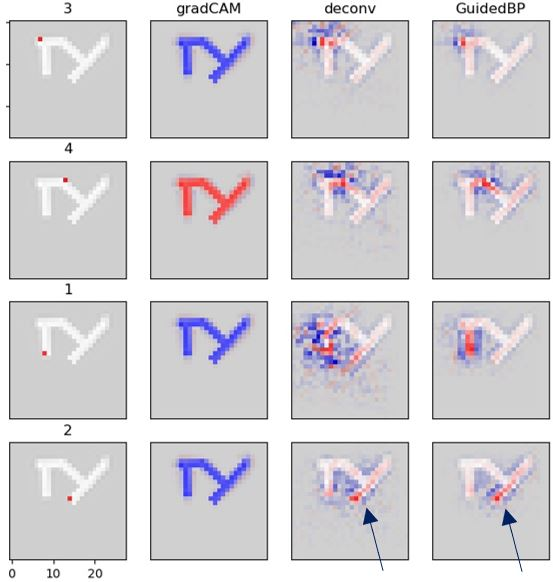

# GPT

This repository contains codes related to the concepts General Pattern Theory (GPT) from:
_Grenander, U. General Pattern Theory: A Mathematical Study of Regular Structures. Oxford Mathematical Monographs. Clarendon Press, 1993. ISBN 9780198536710_. We refer to this as the _textbook_.

See "Get Started.docx" in notebooks folder.

Currently available:

**1. src/APL_to_python**<br>
The folder contains python version of APL codes in the textbook. See "Get Started.docx" to read about step by step translations plus simple testings. Or, jump directly to the results using the following (also try it with different example_n):
```
python simple_algo_section4.2.2.py --example_n 1
```


**2. src/gpt_mnist**<br>
The folder contains source codes related to the paper titled _Convolutional Neural Network Interpretability with General Pattern Theory_ [in review, update later]. See README.gpt_mnist.md.

